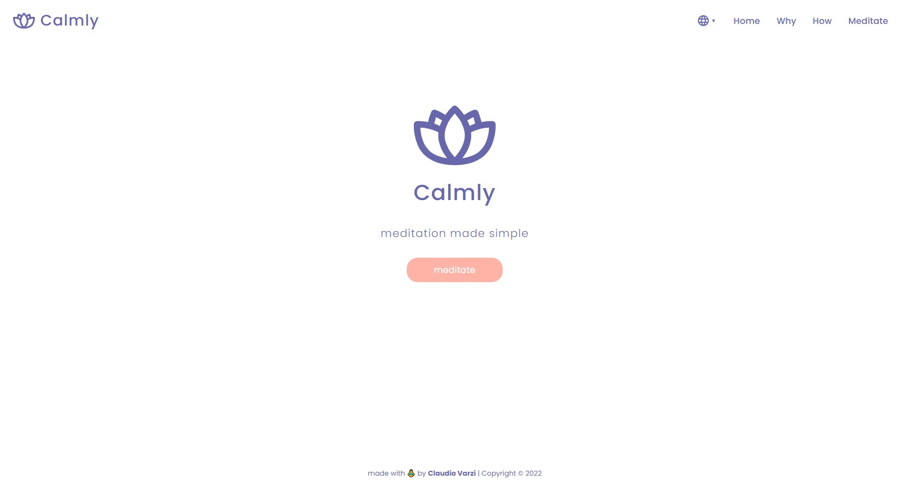

<p align="center">
  
  <h3 align="center">SoulCenter.ai</h3>

  <p align="center">
    A simply website to facilitate meditation, built with React. </p>

  <br>
  <br>

  <a href="https://github.com/claudiovarzi/meditation-app">
    
  </a>
</p>

<details open="open">
  <summary><h2 style="display: inline-block">Table of Contents</h2></summary>
  <ol>
    <li>
      <a href="#about-the-project">About The Project</a>
      <ul>
        <li><a href="#built-with">Built With</a></li>
      </ul>
    </li>
    <li>
      <a href="#getting-started">Getting Started</a>
      <ul>
        <li><a href="#prerequisites">Prerequisites</a></li>
        <li><a href="#installation">Installation</a></li>
      </ul>
    </li>
    <li><a href="#license">License</a></li>
    <li><a href="#links-contacts">Links & Contacts</a></li>
    <li><a href="#acknowledgements">Acknowledgements</a></li>
  </ol>
</details>

## About The Project

This is a simply meditation website made to facilitate meditation practice and let the user expand his knowledge about this ancient but current topic. Information and details are the result of personal research and practice.
User can explore four main routes:

<ul>
<li>the <strong>Home page</strong>, </li>

<li>the <strong>Why section</strong>, which contains the 13 biggest benefits of meditation, </li>

<li>the <strong>How section</strong>, which explains the principal steps to practice meditation, </li>

<li>the <strong>Meditate section</strong>, which lets the user setup his meditation session with background sounds and duration, and start the meditation timer. </li>
</ul>

### Built With

- [React](https://it.reactjs.org/)
- [react-router-dom-v6](https://reactrouter.com/docs/en/v6/upgrading/v5)
- [CSS modules](https://github.com/css-modules/css-modules)
- [react-responsive](https://www.npmjs.com/package/react-responsive)
- [react-icons](https://react-icons.github.io/react-icons/)
- [react-country-flag](https://github.com/danalloway/react-country-flag)
- [react-i18next](https://react.i18next.com/)

## Getting Started

### Prerequisites

Running the application requires [Node](https://nodejs.org/en/) to be installed on your operating system.

You can then install the latest version of npm from your terminal with the command:

```sh
npm install npm@latest -g
```

### Installation

1. Clone the repository locally with the git command:

   ```sh
   git clone https://github.com/claudiovarzi/meditation-app
   ```

2. Install NPM packages:

   ```sh
   npm install
   ```

3. Run the app with command:

   ```sh
   npm start
   ```

## License

Distributed under the MIT License. See `LICENSE` for more information.

## Links & Contacts

Project Repository: [meditation-app](https://github.com/claudiovarzi/meditation-app)

Project Website: [Calmly - Netlify](https://calmly.netlify.app/)

## Acknowledgements

- [React](https://it.reactjs.org/)
- [CSS modules](https://github.com/css-modules/css-modules)
- [react-router-dom-v6](https://reactrouter.com/docs/en/v6/upgrading/v5)
- [react-icons](https://react-icons.github.io/react-icons/)
- [react-responsive](https://www.npmjs.com/package/react-responsive)
- [react-country-flag](https://github.com/danalloway/react-country-flag)
- [react-i18next](https://react.i18next.com/)
- [Best-README-Template](https://github.com/othneildrew/Best-README-Template)
- [Awesome README](https://github.com/matiassingers/awesome-readme)
